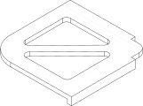
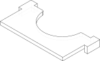

# 3D prints

Just a collection of various 3D printed parts I've designed for my boat and other projects since I've started using [build123d](https://build123d.readthedocs.io/) instead of SOLIDWORKS. These parts are mostly for my own purposes and not necessarily designed to be shared or reused, but if you find them useful feel free to remix them or do whatever you like with them; I offer no support or guarantees. If I do design a part for sharing, I'll put it in its own repo with better docs.

Models are defined as python files in the root directory.

## Development

The easiest way to run this is by creating a Codespace or devcontainer in this repo, so everything comes preinstalled. Then develop using VSCode and the [ocp-vscode](https://github.com/bernhard-42/vscode-ocp-cad-viewer) extension allows for easily previewing changes. When ready to build the model, just run the corresponding Python file. Models are also built automatically on `git commit`.

## Parts

### spare-blade-fuse-holder

Holder for six (or more, by changing file parameters) ATC blade fuses. Great for storing extra fuses right next to the corresponding panel on a boat or car. Securely grips fuses so they won't fall out. Designed to be fastened with two #8 screws. I recommend printing this one out of PETG for heat resistance.

[Source](spare-blade-fuse-holder.py) · [3MF](output/spare-blade-fuse-holder/spare-blade-fuse-holder.3mf) · [STL](output/spare-blade-fuse-holder/spare-blade-fuse-holder.stl) · [SVG](output/spare-blade-fuse-holder/spare-blade-fuse-holder.svg)

### corner-router-template

Template for routing rounded corners using a top-bearing straight bit on a fixed base router. Extra surface area included to allow room for clamping even with full-size router bases. Long alignment guides to jump over any existing cuts. 

Defaults to 1/2" corner radius but can easily be customized by changing the parameters and running the file.

[Source](corner-router-template.py) · [3MF](output/corner-router-template/corner-router-template.3mf) · [STL](output/corner-router-template/corner-router-template.stl) · [SVG](output/corner-router-template/corner-router-template.svg)

### half-circle-router-template

Template for routing a half-circle in the end of a plank. I used this for making a cutout in my cabin table to go around my mast support post on my sailboat. Designed for use with top-bearing straight bit on fixed base router, but doesn't have enough room for clamping so you have to be cautious (or make it longer).

[Source](half-circle-router-template.py) · [3MF](output/half-circle-router-template/half-circle-router-template.3mf) · [STL](output/half-circle-router-template/half-circle-router-template.stl) · [SVG](output/half-circle-router-template/half-circle-router-template.svg)

### edson-pedestal-cupholder

WIP: cupholder to replace instrument pod on old Edson sailboat helm pedestals. Designed to fit large water bottles and coffee mugs with handles, and includes a place to clip on a handheld VHF radio. Printed in PETG.

[Source](edson-pedestal-cupholder.py) · [3MF](output/edson-pedestal-cupholder/edson-pedestal-cupholder.3mf) · [STL](output/edson-pedestal-cupholder/edson-pedestal-cupholder.stl) · [SVG](output/edson-pedestal-cupholder/edson-pedestal-cupholder.svg)

### part-template

Just a simple file scaffold for starting new parts.

[Source](part-template.py) · [3MF](output/part-template/part-template.3mf) · [STL](output/part-template/part-template.stl) · [SVG](output/part-template/part-template.svg)
